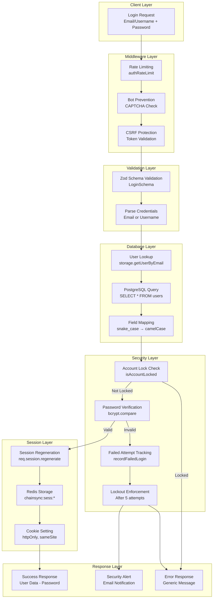
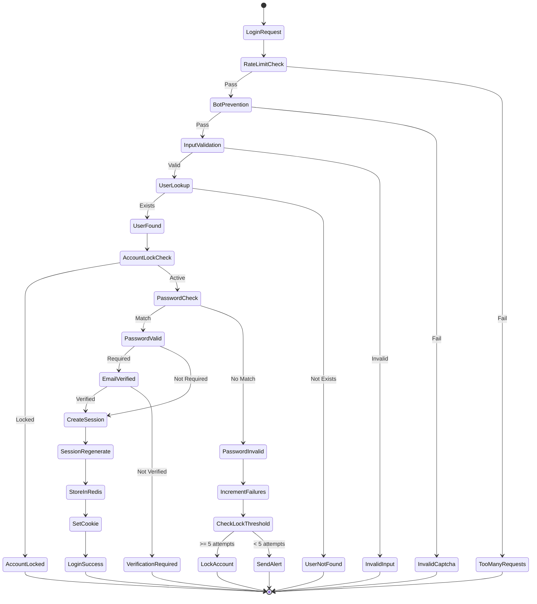

# ChainSync 2.0 - Authentication Flow Visualization

## Quick Reference Flow Diagram



## Authentication State Machine



## Data Flow Through Components

```
┌─────────────────────────────────────────────────────────────────────┐
│                         HTTP REQUEST                                 │
│  POST /api/auth/login                                               │
│  Body: { email: "user@example.com", password: "SecurePass123!" }    │
└─────────────────────────────────────────────────────────────────────┘
                                    │
                                    ▼
┌─────────────────────────────────────────────────────────────────────┐
│                      MIDDLEWARE PIPELINE                             │
│  1. authRateLimit          → Check request rate                     │
│  2. botPreventionMiddleware → Verify CAPTCHA if required            │
│  3. CSRF Protection        → Validate CSRF token                    │
└─────────────────────────────────────────────────────────────────────┘
                                    │
                                    ▼
┌─────────────────────────────────────────────────────────────────────┐
│                      VALIDATION (Zod Schema)                         │
│  LoginSchema.safeParse(req.body)                                    │
│  - Email format validation                                          │
│  - Password min length (8 chars)                                    │
└─────────────────────────────────────────────────────────────────────┘
                                    │
                                    ▼
┌─────────────────────────────────────────────────────────────────────┐
│                    DATABASE QUERY (PostgreSQL)                       │
│  SELECT * FROM users WHERE email = 'user@example.com'               │
│                                                                      │
│  Result: {                                                          │
│    id: "uuid-123",                                                  │
│    email: "user@example.com",                                       │
│    password_hash: "$2b$12$...",                                     │
│    email_verified: true,                                            │
│    failed_login_attempts: 0,                                        │
│    locked_until: null                                               │
│  }                                                                   │
└─────────────────────────────────────────────────────────────────────┘
                                    │
                                    ▼
┌─────────────────────────────────────────────────────────────────────┐
│                      SECURITY CHECKS                                 │
│  1. Account Lock Status    → Check locked_until timestamp           │
│  2. Password Verification  → bcrypt.compare(password, hash)         │
│  3. Email Verification     → Check email_verified flag              │
└─────────────────────────────────────────────────────────────────────┘
                                    │
                                    ▼
┌─────────────────────────────────────────────────────────────────────┐
│                    SESSION MANAGEMENT (Redis)                        │
│  1. req.session.regenerate()  → New session ID                      │
│  2. Set session data:                                               │
│     - userId: "uuid-123"                                            │
│     - twofaVerified: false                                          │
│  3. Store in Redis:                                                 │
│     Key: "chainsync:sess:abc123..."                                 │
│     Value: {userId, twofaVerified, ...}                             │
│     TTL: 28800 seconds (8 hours)                                    │
└─────────────────────────────────────────────────────────────────────┘
                                    │
                                    ▼
┌─────────────────────────────────────────────────────────────────────┐
│                      HTTP RESPONSE                                   │
│  Status: 200 OK                                                     │
│  Set-Cookie: chainsync.sid=s:abc123...; HttpOnly; SameSite=Lax     │
│  Body: {                                                            │
│    status: "success",                                               │
│    message: "Login successful",                                     │
│    user: { id, email, firstName, lastName, ... }                   │
│  }                                                                   │
└─────────────────────────────────────────────────────────────────────┘
```

## Key Security Checkpoints

| Checkpoint | Purpose | Implementation |
|------------|---------|----------------|
| **Rate Limiting** | Prevent brute force | Max 5 requests/minute per IP |
| **Bot Prevention** | Stop automated attacks | Optional CAPTCHA validation |
| **CSRF Protection** | Prevent cross-site attacks | Token validation + SameSite cookies |
| **Input Validation** | Prevent injection | Zod schema validation |
| **Account Lockout** | Limit failed attempts | Lock after 5 failures for 30 min |
| **Password Hashing** | Secure storage | Bcrypt with 12 salt rounds |
| **Session Fixation** | Prevent hijacking | Regenerate session ID on login |
| **Secure Cookies** | Prevent XSS/MITM | HttpOnly, Secure, SameSite flags |

## Error Response Flow

```
Failed Login Attempt
        │
        ▼
┌─────────────────┐
│ Increment Count │
│ in Database     │
└─────────────────┘
        │
        ▼
┌─────────────────┐     Yes     ┌──────────────────┐
│ Count >= 5?     ├─────────────►│ Lock Account     │
└────────┬────────┘              │ for 30 minutes  │
         │ No                    └──────────────────┘
         ▼
┌─────────────────┐
│ Log to Audit    │
│ Table           │
└─────────────────┘
         │
         ▼
┌─────────────────┐
│ Send Security   │
│ Alert Email     │
└─────────────────┘
         │
         ▼
┌─────────────────┐
│ Return Generic  │
│ Error Message   │
└─────────────────┘
```

## Component Locations Quick Reference

| Component | File | Key Functions |
|-----------|------|---------------|
| **Login Endpoint** | `server/api/routes.auth.ts:229` | Main login handler |
| **Password Utils** | `server/auth-enhanced.ts:59-71` | Hash & compare |
| **Account Lockout** | `server/auth-enhanced.ts:76-153` | Lock verification & tracking |
| **Session Config** | `server/session.ts:11-42` | Redis/Express setup |
| **Redis Client** | `server/lib/redis.ts:5-22` | Singleton client |
| **Storage Layer** | `server/storage.ts:313-353` | User lookup & field mapping |
| **User Schema** | `shared/schema.ts:29-65` | PostgreSQL table |
| **Session Schema** | `shared/schema.ts:730-736` | Session storage |
| **Validation** | `server/schemas/auth.ts:72-81` | Zod schemas |
| **Session Types** | `server/types/session.d.ts:6-12` | TypeScript definitions |
